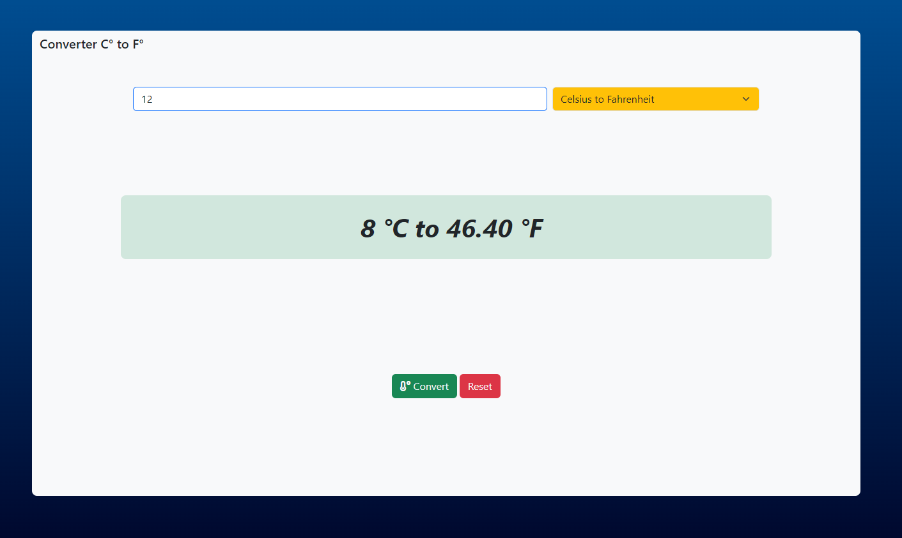

# Temperature-conversion
A mini-project about a detailed temperature (Celsius-Fahrenheit-Klevin-Rankin) conversion website written to enhance JavaScript coding and DOM element changes.

## Preview

## Checklist Features

- Temperature-conversion
- Show temperature changes and conversions
- Change the title of the site
- Use select to change the type of temperature and convert them to another
- In the coding section of the JavaScript file, information about the formulas of each temperature is written

 - °C to °F Celsius to Fahrenheit
 - °F to °C Fahrenheit to Celsius
 - °K to °C Kelvin to Celsius
 - °C to °K Celsius to Kelvin
 - °R to °C Rankine to Celsius
 - °C to °R Celsius to Rankine

                              
                              
                             

Uploading demo Temp.mp4…

